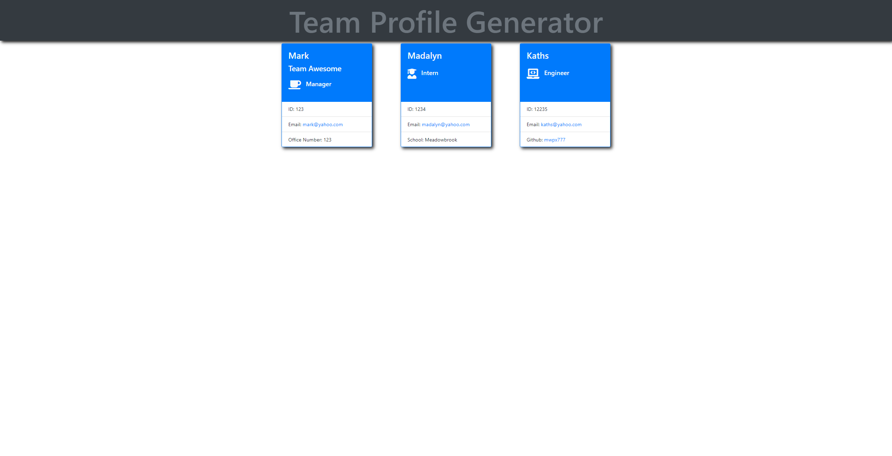

# **Team-Profile-Generator**   
## **In this weekly challenge, we had to create a Team Profile Generator using Nodejs and NPM Inquirer.  We also needed to run tests on the classes using Jest.**

## **Table of Contents**

* [Deployed Application](#deployed-application)

* [Screenshot](#screenshot)

* [Installation](#installation)

* [Features](#features)

* [Usage](#usage)

* [Credits](#credits)

* [License](#license)

* [Badges](#badges)

* [Technology](#technology)

* [Acknowledgements](#acknowledgements)

* [Contact](#contact-information)

## **Deployed Application**
https://mwpx777.github.io/Team-Profile-Generator/

## **Screenshot**

## **Installation**
Type node index.js from the command line

## **Features**
This project features the use of Node.js, NPM Inquirer and Jest

## **Usage**
This application can be used to generate a team profile website with cards for each employee of a team.

## **Credits**
undefined

## **License**
(https://opensource.org/licenses/MIT)

## **Badges**

## **Technology**
HTML,CSS,Javascript,Bootstrap,Node.js

## **Acknowledgements**
undefined

## **Tests**

## **Contact Information**
##### For questions or comments, please contact

* Github: (https://github.com/mwpx777)

* LinkedIn: (https://www.linkedin.com/in/mwpdesigns/ )

* Email: (mwpx777@gmail.com)

